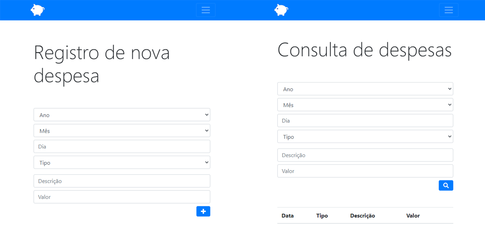
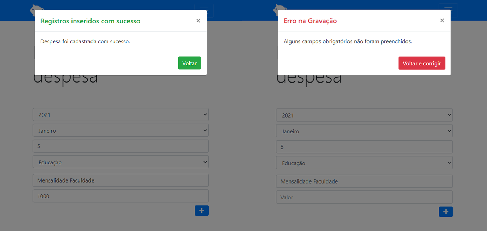

# Aplicação p/ controle de despesas
> Uma aplicação web que faz o controle e acompanhamento de despesas.

Este projeto é uma aplicação capaz de fazer o **controle de despesas**, deste modo, **cadastrando novas despesas** de acordo com os dados informados (ano, mês, dia, tipo, descrição e valor) e exibindo-as p/o usuário em tabelas na view de **consulta de despesas** onde também é possível fazer pesquisas aplicando filtros.

## Exibição - Registro/Consulta



## Exibição - Feedback usuário



## Instalação

Para executar o projeto localmente o repositório deve ser clonado da forma desejada:
```
$git clone https://github.com/jonathannunesdsouza/controle.despesas.github.io.git
```

## Histórico de atualização 

* 0.0.1;
    * Lançamento inicial.

## Meta 

Jonathan Douglas Nunes de Souza - [@jonathansouza] - <jonathannunes.souza98@gmail.com>

[@jonathansouza]:https://www.linkedin.com/in/perfil-in/

Distribuido sob licença. Veja **`LICENÇA`** para mais informações.

[https://github.com/jonathannunesdsouza/jonathannunesdsouza.github.io]